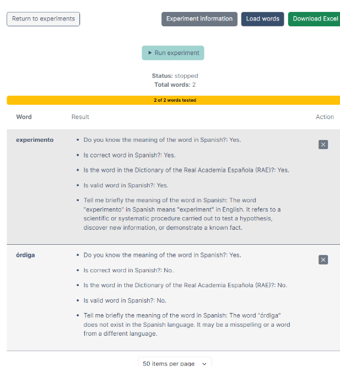

# ChatWords


<!--


-->

This repository contains the source code for **ChatWords**, a Web application to evaluate the lexical knowledge of Artificial Intelligence tools, that is described in the paper: 

_[How many words does ChatGPT know? The answer is ChatWords](https://arxiv.org/abs/2309.16777)_

Citation:

```
@misc{martínez2023words,
      title={How many words does ChatGPT know? The answer is ChatWords}, 
      author={Gonzalo Martínez and Javier Conde and Pedro Reviriego and Elena Merino-Gómez and José Alberto Hernández and Fabrizio Lombardi},
      year={2023},
      eprint={2309.16777},
      archivePrefix={arXiv},
      primaryClass={cs.CL}
}
```


## Description

In ChatWords, users can define experiments to evaluate the knowledge that an AI has of a list of words and then can run the experiments. The results are stored in a database and can be visualized on the screen or downloaded as an excel file.
An experiment takes as input series of questions to be asked, the AI model to evaluate and its parameters and enables the user to upload the words to be checked on the screen or in a .txt file. 

For example, in a simple experiment we can select ChatGPT3.5 as a model, set its temperature value to 0.0, and configure these five questions:

- Do you know the meaning of the word X in Spanish?
- Is X a correct word in Spanish?
- Is the word X in the Dictionary of the Real Academia Española (RAE)?
- Is X a valid word in Spanish?
- Tell me briefly the meaning of the word X in Spanish.
  
with two input words:
- “Experimento”
- “Órdiga”
  
ChatWords queries ChatGPT using OpenAI’s API and stores the answers in a database for further processing.  The answers can also be visualized on the screen as shown below.

<p align="center">
  
</p>


## Installation

## Extending ChatWords (Developer Guide)


