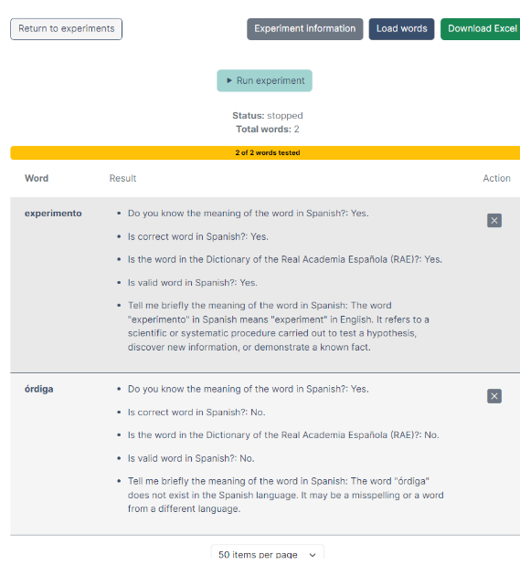

# ChatWords


<!--


-->

This repository contains the source code for **ChatWords**, a Web application to evaluate the lexical knowledge of Artificial Intelligence tools, that is described in the paper: 

_[How many words does ChatGPT know? The answer is ChatWords](https://arxiv.org/abs/2309.16777)_

Citation:

```
@misc{martínez2023words,
      title={How many words does ChatGPT know? The answer is ChatWords}, 
      author={Gonzalo Martínez and Javier Conde and Pedro Reviriego and Elena Merino-Gómez and José Alberto Hernández and Fabrizio Lombardi},
      year={2023},
      eprint={2309.16777},
      archivePrefix={arXiv},
      primaryClass={cs.CL}
}
```


## Description

In ChatWords, users can define experiments to evaluate the knowledge that an AI has of a list of words and then can run the experiments. The results are stored in a database and can be visualized on the screen or downloaded as an excel file.
An experiment takes as input series of questions to be asked, the AI model to evaluate and its parameters and enables the user to upload the words to be checked on the screen or in a .txt file (the file is parsed to extract the list of unique words, erasing punctuation marks, but note that this list may include number or other artifacts present in the source file). 

For example, in a simple experiment we can select ChatGPT3.5 as a model, set its temperature value to 0.0, and configure these five questions:

- Do you know the meaning of the word X in Spanish?
- Is X a correct word in Spanish?
- Is the word X in the Dictionary of the Real Academia Española (RAE)?
- Is X a valid word in Spanish?
- Tell me briefly the meaning of the word X in Spanish.
  
with two input words:
- “Experimento”
- “Órdiga”
  
ChatWords queries ChatGPT using OpenAI’s API and stores the answers in a database for further processing.  The answers can also be visualized on the screen as shown below.

<p align="center">
  
</p>


## Installation

ChatWords is programmed in Nest.js (a progressive Node.js framework for the development of web applications) for the back-end, and Angular (a web development JavaScript framework) for the
front-end. The application stores the configuration and results for each experiment in a simple and easy-to-configure database. To install the application, perform the following steps.

### Prerequisites

- Git: To clone the repository, you need Git installed on your machine.
- Node.js: The project requires Node.js version 18 or higher. You can download it from the [official Node.js website](https://nodejs.org/).
- npm: Chatwords requires you to have npm version 9 or higher, which typically comes with Node.js. To check your npm version, execute `npm -v` in your terminal.

### Cloning the repository

1. Open your terminal
2. Run the following command to clone the repository of the project:
   ```bash
   git clone https://github.com/WordsGPT/ChatWords.git
   ```
3. Change to the cloned repository
   ```bash
   cd ChatWords
   ```
   
### Back-end Installation

1. Change directory to the backend folder:

```bash
cd backend
```

2. Install the required packages:

```bash
npm install
```

3. If you encounter any critical or moderate vulnerabilites in the installed packages, execute:

```bash
npm audit fix
```


### Front-end Installation

1. Move to the front-end folder at the root of the ChatWords directory:

```bash
cd ..
cd frontend
```

2. Install the required packages:

```bash
npm install
```

### Executing the application

To execute the application, you need to run both the back-end and front-end. To do so, launch two terminals, performing the following commands in each of them.

To execute the back-end:

- Development Mode: Run `npm run` start.
- Watch Mode: Run `npm run start:dev` for live reloading.
- Production Mode: Run `npm run start:prod`.

To execute the front-end:

- Development Mode: Run `npm run start`

In Windows machines, you might be prompted to allow Node.js component to connect to the network. Press "Accept" to enable the network access of the process. 

To access the application, open your browser and navigate to `http://localhost:4200/` 

### Building the front-end

Run `ng build` to build the project. This will optimize the existing Angular code, creating some new artifacts. The build artifacts will be stored in the `dist/` directory.

## Extending ChatWords (Developer Guide)


